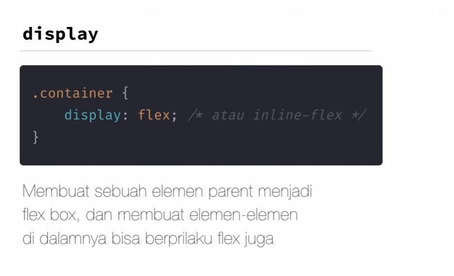
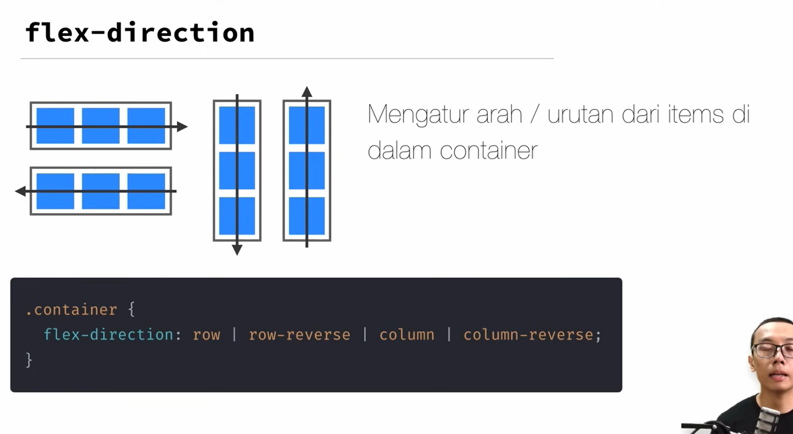
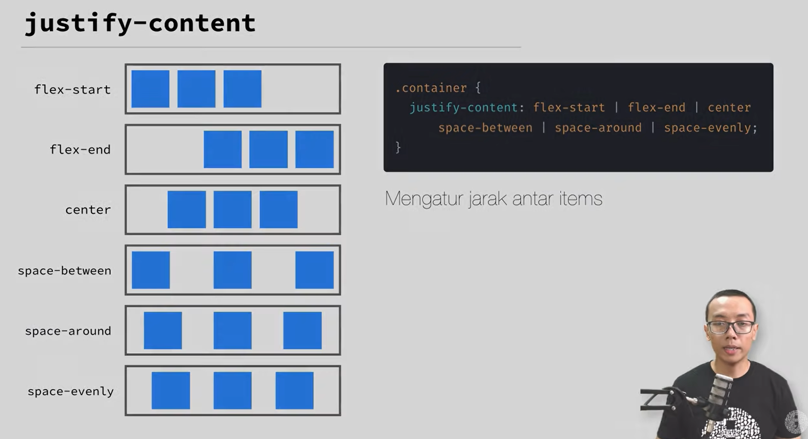
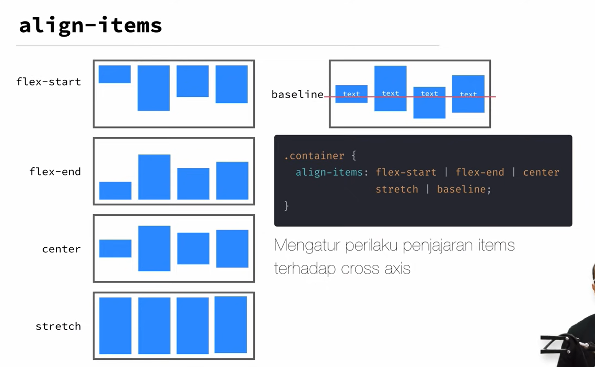
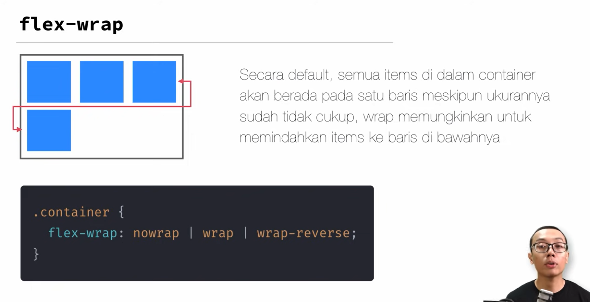
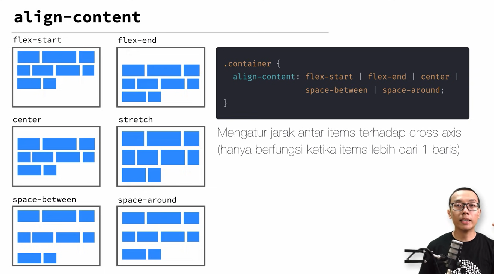
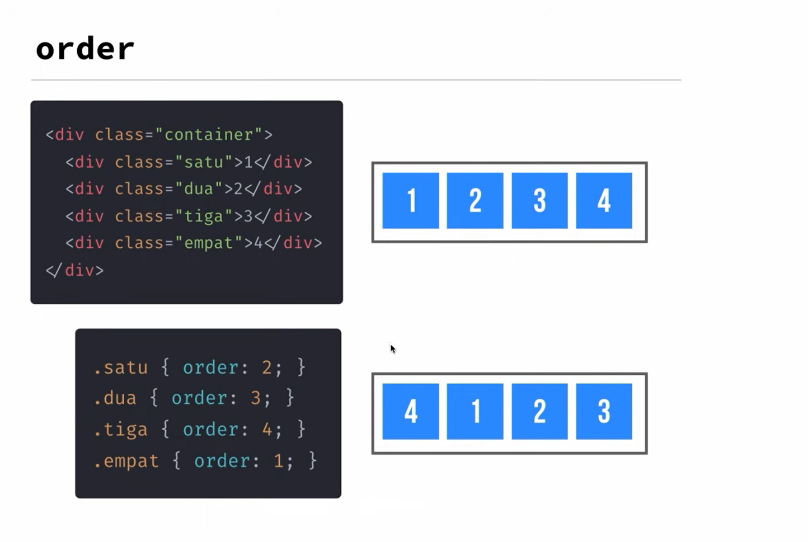
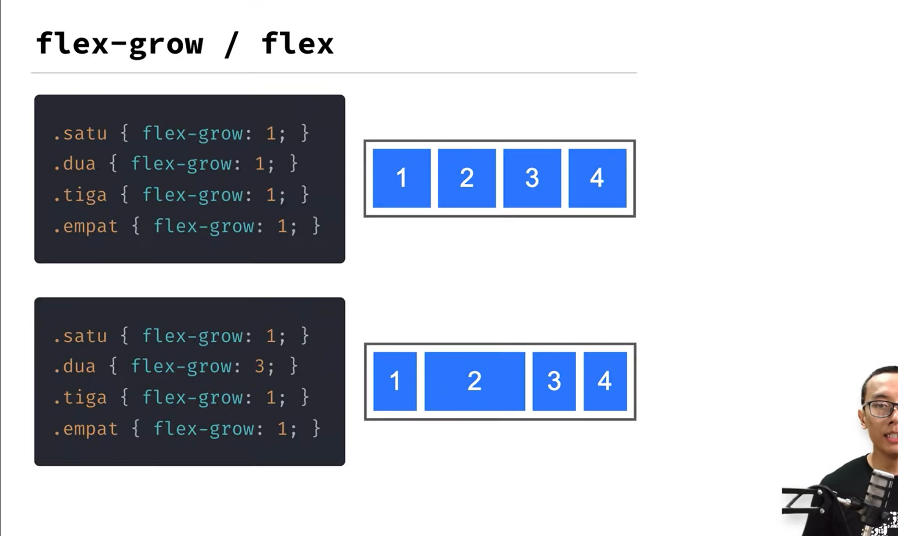
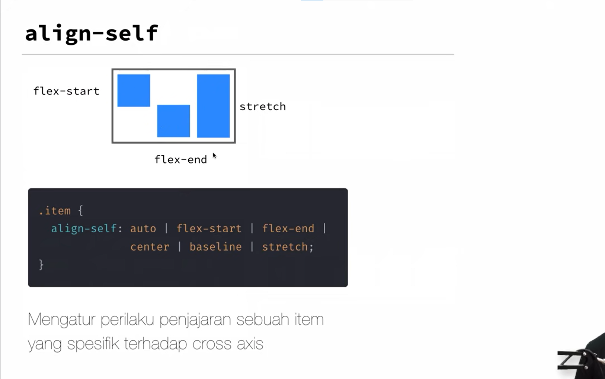

# Properti Flex Container
Link To Learn : [Flexbox Froggy](https://flexboxfroggy.com/)

## 1. `display: flex;`

Menjadikan elemen menjadi flex container.

## 2. `flex-direction`

Menentukan arah aliran flex items per baris.
* `row` (default): Dari kiri ke kanan.
* `row-reverse`: Dari kanan ke kiri.
* `column`: Dari atas ke bawah.
* `column-reverse`: Dari bawah ke atas.

## 3. `justify-content`

Mengatur penyebaran flex items sepanjang main axis.
* `flex-start`: Menyusun item di awal container.
* `flex-end`: Menyusun item di akhir container.
* `center`: Menyusun item di tengah container.
* `space-between`: Menyebarkan item dengan jarak yang sama di antara mereka.
* `space-around`: Menyebarkan item dengan jarak yang sama di sekitar mereka.

## 4. `align-items`

Mengatur penyebaran flex items sepanjang cross axis.
* `flex-start`: Menyusun item di awal cross axis.
* `flex-end`: Menyusun item di akhir cross axis.
* `center`: Menyusun item di tengah cross axis.
* `baseline`: Menyusun item berdasarkan garis dasar teks.
* `stretch`: Meregangkan item untuk mengisi container (tengahnya kosong).

## 5. `flex-wrap`

Menentukan apakah flex items harus dibungkus ke baris/kolom berikutnya.
* `nowrap` (default): Tidak membungkus.
* `wrap`: Membungkus item ke baris berikutnya.
* `wrap-reverse`: Membungkus item ke baris sebelumnya (reverse). Menjadikan baris awalnya adalah dari paling akhir (Membalik)

## 5.1 `flex-flow`
Penggabungan flex-direction dan flex-wrap
Syntax: `flex-flow: <flex-direction> <flex-wrap>;`.

## 6. `align-content`

Mengatur penyebaran baris flex items sepanjang cross axis (berfungsi ketika ada ruang ekstra pada cross axis).
* `flex-start`, 
* `flex-end`, 
* `center`, 
* `space-between`, 
* `space-around`, 
* `stretch`.

# Properti Pada Items

## 1. `order`

Menentukan urutan flex setiap item. Default adalah 0.

## 2. `flex-grow` / `flex`

Menentukan kemampuan item untuk tumbuh jika ada ruang kosong. Default adalah 0.

## 3. `flex-shrink`
Menentukan kemampuan item untuk menyusut jika ruang tidak cukup. Default adalah 1.

## 4. `flex-basis`
Menentukan ukuran dasar dari item sebelum distribusi ruang tambahan. Bisa berupa `auto`, ukuran tetap (`px`, `%`, dll.).

## 5. `align-self`

Mengatur alignment individu item sepanjang cross axis (mengabaikan align-items pada container).
* `auto`, `flex-start`, `flex-end`, `center`, `baseline`, `stretch`.

