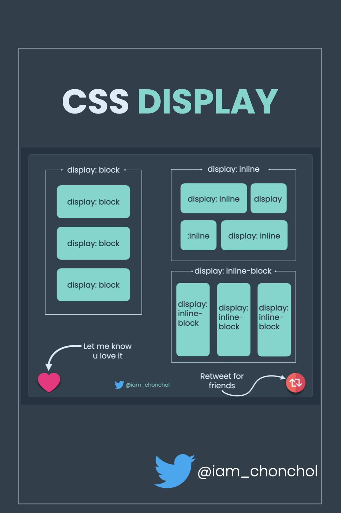

# Properti Display dalam CSS

Properti `display` dalam CSS adalah salah satu properti paling penting yang menentukan bagaimana elemen HTML akan dirender di halaman web. Berikut ini adalah penjelasan tentang nilai-nilai yang paling umum digunakan dalam properti `display`.


## Nilai-Nilai Display

### 1. `block`
- Elemen dengan `display: block;` akan menempati seluruh lebar yang tersedia, dimulai pada baris baru.
- Contoh elemen blok: `<div>`, `<h1>`, `<p>`, `<header>`, dan `<footer>`.

### 2. `inline`
- Elemen dengan `display: inline;` tidak memulai baris baru dan hanya mengambil lebar yang dibutuhkan oleh kontennya.
- Contoh elemen inline: `<span>`, `<a>`, `<strong>`, dan `<em>`.

### 3. `inline-block`
- Kombinasi antara `inline` dan `block`. Elemen tampil pada satu baris dengan elemen lain, tetapi berperilaku seperti elemen blok, artinya kita bisa menetapkan lebar dan tinggi.
- Berguna untuk elemen yang memerlukan ukuran spesifik tetapi tetap berada dalam satu baris.

### 4. `none`
- Elemen dengan `display: none;` tidak akan tampil di halaman dan tidak mengambil ruang apapun.
- Umumnya digunakan untuk menyembunyikan elemen dari tampilan tanpa menghapusnya dari DOM.

### 5. `flex`
- Elemen dengan `display: flex;` akan menjadi kontainer fleksibel yang memungkinkan penataan elemen anak secara dinamis dan responsif.
- Memberikan kemampuan untuk mengatur tata letak elemen secara efisien dalam satu dimensi (baris atau kolom).

### 6. `grid`
- Elemen dengan `display: grid;` menyediakan tata letak dalam dua dimensi (baris dan kolom).
- Memungkinkan pembuatan tata letak yang kompleks dengan mendefinisikan area dan posisi elemen secara eksplisit.

### 7. `inline-flex`
- Sama seperti `flex`, tetapi elemen kontainer tetap dalam baris yang sama dengan elemen lainnya.

### 8. `inline-grid`
- Sama seperti `grid`, tetapi elemen kontainer tetap dalam baris yang sama dengan elemen lainnya.

## Contoh Penggunaan

Berikut adalah contoh penggunaan dari beberapa nilai `display`:

```html
<!DOCTYPE html>
<html lang="en">
<head>
    <meta charset="UTF-8">
    <meta name="viewport" content="width=device-width, initial-scale=1.0">
    <style>
        .block {
            display: block;
            width: 100%;
            background-color: lightblue;
        }
        
        .inline {
            display: inline;
            background-color: lightcoral;
            padding: 5px;
        }
        
        .inline-block {
            display: inline-block;
            width: 100px;
            height: 100px;
            background-color: lightgreen;
        }
        
        .flex {
            display: flex;
            justify-content: space-around;
            background-color: lightgoldenrodyellow;
            padding: 10px;
        }
        
        .grid {
            display: grid;
            grid-template-columns: repeat(3, 1fr);
            gap: 10px;
            background-color: lightgray;
            padding: 10px;
        }
    </style>
    <title>Contoh Display</title>
</head>
<body>
    <div class="block">Block Element</div>
    
    <div>
        <span class="inline">Inline Element 1</span>
        <span class="inline">Inline Element 2</span>
    </div>
    
    <div>
        <div class="inline-block">Inline-Block 1</div>
        <div class="inline-block">Inline-Block 2</div>
    </div>
    
    <div class="flex">
        <div>Flex Item 1</div>
        <div>Flex Item 2</div>
        <div>Flex Item 3</div>
    </div>
    
    <div class="grid">
        <div>Grid Item 1</div>
        <div>Grid Item 2</div>
        <div>Grid Item 3</div>
        <div>Grid Item 4</div>
    </div>
</body>
</html>
