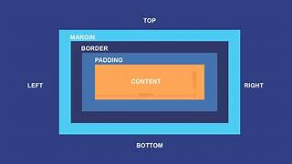
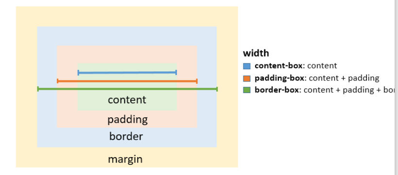

# Box Model dalam CSS

Box Model adalah konsep dasar dalam CSS yang menggambarkan cara elemen HTML dirender oleh browser. Setiap elemen di halaman web dianggap sebagai kotak yang terdiri dari beberapa bagian:

## Komponen Box Model

### 1. Margin (Jarak Luar)

Ruang di luar border, yang memisahkan elemen dari elemen lainnya. Margin dapat diatur menggunakan `margin`, dan dapat ditentukan secara individual untuk setiap sisi.

### 2. Content (Konten)

Bagian yang berisi konten sebenarnya dari elemen, seperti teks atau gambar. Dimensi konten dapat diatur menggunakan properti `width` dan `height`.

### 3. Padding (Jarak Dalam)

Ruang antara konten dan border. Padding dapat diatur menggunakan `padding`, dan dapat ditentukan secara individual untuk setiap sisi (atas, kanan, bawah, kiri).

### 4. Border (Garis Batas)

Garis yang mengelilingi padding (jika ada) dan konten. Border dapat diatur menggunakan `border`, termasuk lebar, gaya, dan warnanya.

## 1. Margin - Cara Pakai

- `margin-top`
- `margin-right`
- `margin-bottom`
- `margin-left`

### Margin - Overlapping margin

- Vertikal: Margin yang paling besar yang akan menang (diambil)

Contoh: Jika div 1 memiliki `margin-bottom: 100px`, dan div 2 yang ada dibawahnya memiliki `margin-top: 20px`, maka margin yang digunakan adalah `20px`.

- Horizontal: Margin elemen satu dan dua yang overlapping akan ditambahkan

Contoh: Jika div 1 memiliki `margin-right: 20px`, dan div 2 memiliki `margin-left: 20px`, maka margin yang digunakan adalah `40px`.

### Negatif Margin

Membuat kotak akan berlawanan arah dan elemen elemen yang dibawahnya akan terbawa.

### Margin - Auto

Khusus untuk margin kiri dan kanan. Otomatis elemen berada di tengah tengah dari parent.

### Margin - Shorthand

Menyingkat penulisan margin. Bisa memuat banyak nilai dengan satu sintaks:

- 1 nilai: `margin: 50px;` (semua sisi diberi margin 50px)
- 2 nilai: `margin: 50px 100px;` (atas dan bawah 50px, kiri dan kanan 100px)
- 3 nilai: `margin: 30px 50px 40px;` (atas, kiri kanan, bawah)
- 4 nilai: `margin: 20px 10px 60px 70px;` (atas,kanan,bawah,kiri (searah jarum jam))

## Box-Sizing
### Properti

box-sizing mengubah cara ukuran elemen diukur dan diperhitungkan dalam tata letak. Ada tiga nilai utama untuk box-sizing:

1. `content-box` (default)
   Lebar dan tinggi elemen diukur hanya berdasarkan konten.
   Padding dan border akan ditambahkan di luar lebar dan tinggi yang ditentukan,

2. `padding-box` (tidak umum digunakan)
   Lebar dan tinggi elemen diukur termasuk padding tetapi tidak termasuk border.

3. `border-box`
   Lebar dan tinggi elemen diukur termasuk padding dan border.

