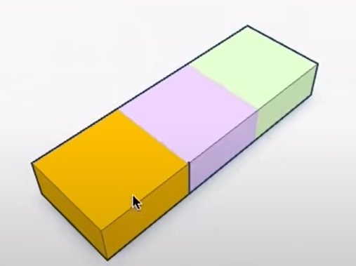
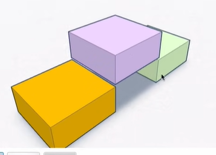
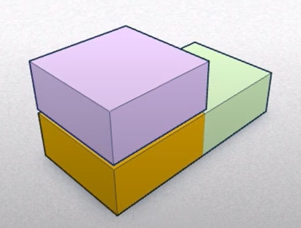
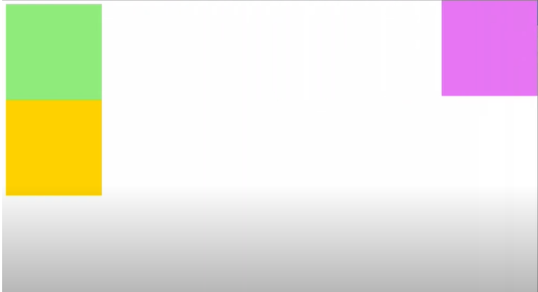
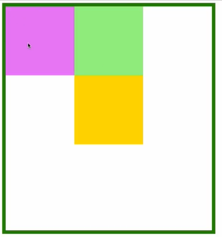
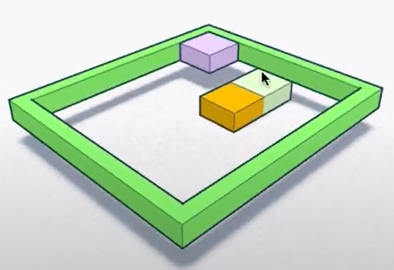

# CSS Position

- `static` nilai default position
- Position selain `static` akan membuat elemen seolah-olah berada di dimensi lain terhadap sumbu z
- Position selain `static` dapat menggunakan properti `top`, `bottom`, `left`, `right` untuk mengatur posisi

Value : `static`, `relative`, `absolute`, `sticky`, `fixed`

## 1. Static (Default)

- **Deskripsi**: Nilai default untuk setiap elemen. Elemen diposisikan sesuai dengan flow normal dokumen.
- **Pengaruh**: Elemen diatur sesuai urutan HTML dan tidak dapat diposisikan menggunakan properti `top`, `right`, `bottom`, atau `left`.



```css
.static-element {
    position: static;
}
```

## 2. Relative

- **Deskripsi**: Elemen diposisikan relatif terhadap posisi normalnya / sebelumnya saat masih `static` dan masih masuk ke dalam **flow**. Anda dapat menggunakan `top`, `right`, `bottom`, dan `left` untuk memindahkan elemen dari posisi defaultnya.
- **Pengaruh**: Elemen masih mengambil tempat dalam flow normal / dari posisi semulanya.



```css
.relative-element {
    position: relative;
    top: 10px;
    left: 20px;
}
```

## 3. Absolute

- **Deskripsi**: Elemen diposisikan relatif terhadap posisi dari elemen parent terdekatnya yang memilki posisi selain `static`. Sehingga memilki dimensi / sumbu-z yang sama.
- **Pengaruh**: Elemen dikeluarkan dari flow dokumen, sehingga ruang yang sebelumnya ditempati elemen tersebut dianggap tidak ada.

### Contoh 1

Code :
```css
.ungu2 {
    position: absolute;
}
```

### Contoh 2

Code:
```css
.ungu2 {
    position: absolute;
    top: 0;
    right: 0;
}
```

### Contoh 3

Code:
```css
.parent {
    position: relative; /* Dimensinya maju dulu */
    margin: auto;
}

.ungu2 {
    position: absolute;
    top: 0;
    left: 0;
}
```

### Contoh 4

Code :
```css
.parent {
    position: relative; /* Dimensinya maju dulu */
    margin: auto;
}

.ungu2 {
    position: relative;
    top: 0;
    left: 0;
}
```


## 4. Fixed

- **Deskripsi**: Elemen diposisikan relatif terhadap viewport (jendela browser) dan tetap pada posisi yang sama bahkan ketika halaman digulir.
- **Pengaruh**: Elemen tidak bergantung pada posisi elemen lain dan tetap di tempat ketika halaman digulir.

```css
.fixed-element {
    position: fixed;
    bottom: 0;
    right: 0;
}
```

## 5. Sticky

- **Deskripsi**: Elemen berperilaku seperti `relative` sampai posisi scroll mencapai batas tertentu, kemudian berperilaku seperti `fixed`. Ini berguna untuk membuat elemen tetap terlihat saat menggulir halaman hingga elemen lain mencapai posisi tertentu.
- **Pengaruh**: Membutuhkan dukungan browser dan pengaturan batas tertentu (`top`, `right`, `bottom`, `left`).

```css
.sticky-element {
    position: sticky;
    top: 0;
}
```

## Contoh HTML

Berikut adalah contoh sederhana yang menunjukkan penggunaan berbagai nilai `position` dalam CSS:

```html
<!DOCTYPE html>
<html lang="en">
<head>
    <meta charset="UTF-8">
    <meta name="viewport" content="width=device-width, initial-scale=1.0">
    <style>
        .static-element {
            position: static;
            background-color: lightgray;
        }

        .relative-element {
            position: relative;
            top: 10px;
            left: 20px;
            background-color: lightblue;
        }

        .absolute-element {
            position: absolute;
            top: 50px;
            right: 20px;
            background-color: lightgreen;
        }

        .fixed-element {
            position: fixed;
            bottom: 0;
            right: 0;
            background-color: lightcoral;
            padding: 10px;
        }

        .sticky-element {
            position: sticky;
            top: 0;
            background-color: lightsalmon;
            padding: 10px;
        }

        .container {
            height: 500px;
            overflow: auto;
        }

        .spacer {
            height: 300px;
            background-color: #f0f0f0;
        }
    </style>
    <title>Position Example</title>
</head>
<body>
    <div class="static-element">Static Element</div>
    <div class="relative-element">Relative Element</div>
    <div class="container">
        <div class="sticky-element">Sticky Element</div>
        <div class="spacer"></div>
        <div class="absolute-element">Absolute Element</div>
    </div>
    <div class="fixed-element">Fixed Element</div>
</body>
</html>
```

## Kesimpulan

Pemahaman yang baik tentang properti `position` memungkinkan Anda mengontrol tata letak halaman web dengan lebih baik dan membuat elemen lebih dinamis. Masing-masing nilai `position` memiliki kegunaan dan efek yang berbeda pada elemen dan tata letak halaman secara keseluruhan.
